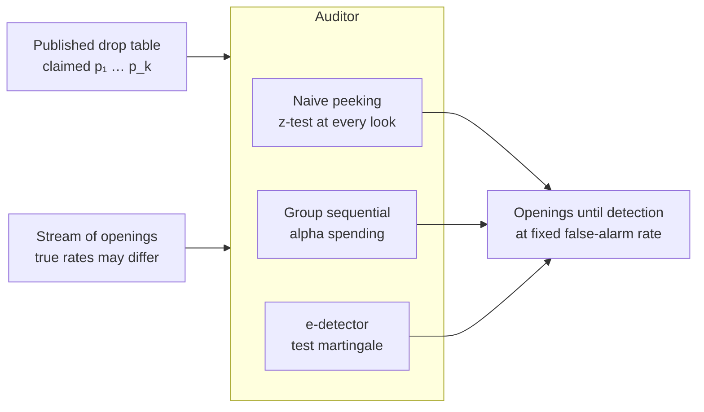

# Loot Box Auditor

[](pyproject.toml)
[](https://github.com/astral-sh/ruff)

An auditor that watches a stream of loot box openings and decides whether the published drop
rates are true — while being allowed to look at the data at every single moment.

**The question this repository is built to answer:**

> On rare items, how many openings does the right to watch continuously actually cost — and
> how does that price change with the size of the understatement being hidden?

Continuous monitoring is the natural mode for a regulator: complaints arrive over time and
nobody gets to pick a sample size in advance. Classical fixed-horizon testing forbids exactly
that. Recent work argues the guarantee is close to free — any fixed-sample test can be turned
into an anytime-valid sequential one that matches it at the planned stopping time
([2501.03982](https://arxiv.org/abs/2501.03982)). That statement is about a *planned* stopping
time, and a regulator has none. This repository measures the price in the currency that
actually matters to an auditor: **openings until detection, at a fixed rate of false alarms.**

**Why loot boxes rather than a generic A/B test.** The setting is real and the numbers are
public. South Korea has required probability disclosure by law since March 2024 and has fined
companies for false disclosures; China requires it too. Compliance research
([PLOS One](https://journals.plos.org/plosone/article?id=10.1371%2Fjournal.pone.0286681))
measures whether rates are disclosed at all — 64% under UK self-regulation against 95.6% under
Chinese law — but not whether the disclosed numbers are true. Verification is the open half,
and it is a sequential problem: the auditor sees a stream, not a sample.

Rarity is what makes it hard, and what makes it interesting. A headline item at p = 0.005
carries almost no information per opening, so detection time is governed by the
Kullback–Leibler divergence between claimed and true rates, not by intuition.



The naive branch is not a competitor — it is the calibration check. If peeking does not inflate
the false-alarm rate in this harness, the harness is wrong before anything else is measured.

## Status

**Phase 0 — the premise test.** No result yet; findings stay empty until there is one:
[FINDINGS.md](FINDINGS.md). Full schedule in the [development plan](docs/development-plan.md).

| Phase | Content | State |
|---|---|---|
| 0 | Kill-test: is the price of continuous monitoring visible in a realistic range? | preregistered, not run |
| 1 | Stream simulator from published drop tables, correctness tests | not started |
| 2 | Fixed horizon and naive peeking: reproduce the α-inflation | not started |
| 3 | e-detector with false-alarm control | not started |
| 4 | **The map**: rarity × understatement → openings until detection | not started |
| 5 | Whole-table monitoring instead of a single item | not started |

## Results

Empty until the simulator and its correctness tests are in place. Every row will carry an
interval over independent streams, and no number enters before the checks in the
[research protocol](docs/research-protocol.md) pass.

| Method | Claimed p | True p | False-alarm rate | Median openings to detect | Interval |
|---|---|---|---|---|---|
| Naive peeking | — | — | — | — | — |
| Fixed horizon | — | — | — | — | — |
| Group sequential | — | — | — | — | — |
| e-detector | — | — | — | — | — |

The false-alarm column is reported for every row including the naive one, because the whole
point is that a method with good detection speed and no error control is not a method.

## Data

Claimed drop tables are real: published disclosures from games operating under Korean and
Chinese law. The stream of openings is simulated, because no public dataset records verified
outcomes at scale — and that absence is precisely why auditing is an open problem rather than
a solved one.

Stated in every report: this measures what an auditor *could* detect given a stream, not what
any particular game is doing. No claim about a named title is made anywhere in this repository
without data that supports it, and simulated streams never support such a claim.

## Reproduce

```bash
make install      # uv sync --extra dev
make check        # ruff + pytest
make kill-test    # phase 0, once its protocol thresholds are fixed
```

## How this repository is meant to be read

- **Error control first, speed second.** Any method that detects fast without a false-alarm
  guarantee is reported as invalid, not as fast.
- **The naive branch is a calibration, not a baseline to beat.**
- **Rarity is the axis.** Results at p = 0.05 say nothing about p = 0.005, and both are
  reported.
- **Negative results are kept.** If anytime-validity turns out to be nearly free here too,
  that is the finding, and it is a useful one for anyone building an audit.

## Layout

```
src/lba/
  stream/         drop tables, opening simulator
  detectors/      fixed horizon, group sequential, e-detector
  evaluation/     false-alarm rate, detection delay, intervals
experiments/      one directory per research question
reports/          results and figures
tests/fixtures/   tiny hand-checkable streams
docs/             plan, research protocol, learning contract
```

## Documents

- [Development plan](docs/development-plan.md) — phases, hours, and where this sits against
  the other three projects.
- [Research protocol](docs/research-protocol.md) — the rules a result must satisfy.
- [Learning contract](LEARNING.md) — how this codebase is authored and how AI assistance is
  and is not used in it.
